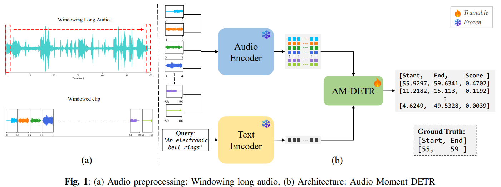

<table>
  <tr>
    <th rowspan="3" align="center" valign="middle">ID</th>
    <th rowspan="3" align="center" valign="middle">Audio Encoder</th>
    <th rowspan="3" align="center" valign="middle">Text Encoder</th>
    <th colspan="5" align="center" valign="middle">CASTELLA only </th>
    <th colspan="5" align="center" valign="middle">Two Stage Training <br>PT: Clotho-Moment, FT: CASTELLA</th>
  </tr>
  <tr>
    <td colspan="2" align="center" valign="middle">Recall1 ↑</td>
    <td colspan="3" align="center" valign="middle">mAP ↑</td>
    <td colspan="2" align="center" valign="middle">Recall1 ↑</td>
    <td colspan="3" align="center" valign="middle">mAP ↑</td>
  </tr>
  <tr>
    <td align="center" valign="middle">@0.5</td>
    <td align="center" valign="middle">@0.7</td>
    <td align="center" valign="middle">avg</td>
    <td align="center" valign="middle">@0.5</td>
    <td align="center" valign="middle">@0.75</td>
    <td align="center" valign="middle">@0.5</td>
    <td align="center" valign="middle">@0.7</td>
    <td align="center" valign="middle">avg</td>
    <td align="center" valign="middle">@0.5</td>
    <td align="center" valign="middle">@0.75</td>
  </tr>
  <tr>
    <td align="center" valign="middle">M1</td>
    <td align="center" valign="middle">Baseline: MSCLAP</td>
    <td align="center" valign="middle">Baseline: MSCLAP</td>
    <td align="center" valign="middle">23.16</td>
    <td align="center" valign="middle">10.32</td>
    <td align="center" valign="middle">9.11</td>
    <td align="center" valign="middle">20.34</td>
    <td align="center" valign="middle">6.96</td>
    <td align="center" valign="middle">25.61</td>
    <td align="center" valign="middle">13.59</td>
    <td align="center" valign="middle">12.06</td>
    <td align="center" valign="middle">23.60</td>
    <td align="center" valign="middle">10.72</td>
  </tr>
  <tr>
    <td align="center" valign="middle">M2</td>
    <td align="center" valign="middle">M2D-CLAP</td>
    <td align="center" valign="middle">M2D-CLAP</td>
    <td align="center" valign="middle">26.73</td>
    <td align="center" valign="middle">12.32</td>
    <td align="center" valign="middle">10.39</td>
    <td align="center" valign="middle">22.98</td>
    <td align="center" valign="middle">8.81</td>
    <td align="center" valign="middle">43.88</td>
    <td align="center" valign="middle">25.39</td>
    <td align="center" valign="middle">19.40</td>
    <td align="center" valign="middle">36.89</td>
    <td align="center" valign="middle">17.50</td>
  </tr>
  <tr>
    <td align="center" valign="middle">M3</td>
    <td align="center" valign="middle">LAION-CLAP</td>
    <td align="center" valign="middle">LAION-CLAP</td>
    <td align="center" valign="middle">19.45</td>
    <td align="center" valign="middle">7.42</td>
    <td align="center" valign="middle">6.86</td>
    <td align="center" valign="middle">16.72</td>
    <td align="center" valign="middle">4.97</td>
    <td align="center" valign="middle">38.08</td>
    <td align="center" valign="middle">21.97</td>
    <td align="center" valign="middle">16.38</td>
    <td align="center" valign="middle">31.47</td>
    <td align="center" valign="middle">15.09</td>
  </tr>
  <tr>
    <td align="center" valign="middle">M4</td>
    <td align="center" valign="middle">BEATs</td>
    <td align="center" valign="middle">T5</td>
    <td align="center" valign="middle">18.63</td>
    <td align="center" valign="middle">8.02</td>
    <td align="center" valign="middle">7.01</td>
    <td align="center" valign="middle">15.98</td>
    <td align="center" valign="middle">5.28</td>
    <td align="center" valign="middle">34.45</td>
    <td align="center" valign="middle">19.97</td>
    <td align="center" valign="middle">15.64</td>
    <td align="center" valign="middle">29.77</td>
    <td align="center" valign="middle">14.18</td>
  </tr>
  <tr>
    <td colspan="13" align="center" valign="middle">Ensemble</td>
  </tr>
  <tr>
    <td align="center" valign="middle">M5</td>
    <td align="center" valign="middle">(M2D, LAION)-CLAP</td>
    <td align="center" valign="middle">(M2D, LAION)-CLAP</td>
    <td align="center" valign="middle">30.44</td>
    <td align="center" valign="middle">13.81</td>
    <td align="center" valign="middle">11.47</td>
    <td align="center" valign="middle">25.23</td>
    <td align="center" valign="middle">9.20</td>
    <td align="center" valign="middle">43.21</td>
    <td align="center" valign="middle">26.43</td>
    <td align="center" valign="middle">19.49</td>
    <td align="center" valign="middle">35.94</td>
    <td align="center" valign="middle">17.96</td>
  </tr>
  <tr>
    <td align="center" valign="middle">M6</td>
    <td align="center" valign="middle">M2D-CLAP, BEATs</td>
    <td align="center" valign="middle">M2D-CLAP, T5</td>
    <td align="center" valign="middle">28.14</td>
    <td align="center" valign="middle">11.73</td>
    <td align="center" valign="middle">10.80</td>
    <td align="center" valign="middle">24.22</td>
    <td align="center" valign="middle">8.71</td>
    <td align="center" valign="middle">42.09</td>
    <td align="center" valign="middle">25.17</td>
    <td align="center" valign="middle">19.00</td>
    <td align="center" valign="middle">36.47</td>
    <td align="center" valign="middle">16.69</td>
  <tr>
    <td align="center" valign="middle">M7</td>
    <td align="center" valign="middle">LAION-CLAP, BEATs</td>
    <td align="center" valign="middle">LAION-CLAP, T5</td>
    <td align="center" valign="middle">19.97</td>
    <td align="center" valign="middle">7.28</td>
    <td align="center" valign="middle">7.15</td>
    <td align="center" valign="middle">17.51</td>
    <td align="center" valign="middle">5.37</td>
    <td align="center" valign="middle">40.61</td>
    <td align="center" valign="middle">22.79</td>
    <td align="center" valign="middle">17.47</td>
    <td align="center" valign="middle">33.47</td>
    <td align="center" valign="middle">15.39</td>
  </tr>
  <tr>
    <td align="center" valign="middle">M8</td>
    <td align="center" valign="middle">(M2D, LAION)-CLAP, BEATs</td>
    <td align="center" valign="middle">(M2D, LAION)-CLAP, T5</td>
    <td align="center" valign="middle">39.20</td>
    <td align="center" valign="middle">18.63</td>
    <td align="center" valign="middle">15.79</td>
    <td align="center" valign="middle">34.46</td>
    <td align="center" valign="middle">13.16</td>
    <td align="center" valign="middle">41.65</td>
    <td align="center" valign="middle">24.57</td>
    <td align="center" valign="middle">19.01</td>
    <td align="center" valign="middle">35.37</td>
    <td align="center" valign="middle">v</td>
  </tr>  
</table>


[](https://github.com/awkrail/dcase2026_task6_baseline)
[](https://dcase.community/documents/challenge2026/technical_reports/DCASE2026_Chunarkar_82_t6.pdf)
[](https://zenodo.org/records/20770460)
[](https://zenodo.org/records/20772071)
[](https://zenodo.org/records/21626882)

# Pipeline


# Setup
## 1. Clone this repository
```
git clone --depth 1 https://github.com/Snehitc/AMR-encoder-exploration.git && rm -rf AMR-encoder-exploration/.git
cd AMR-encoder-exploration
```
## 2. Create Environment
```
conda create -n AMR python=3.12
conda activate AMR
```
## 3. Install PyTorch (CUDA Version)
```
pip install torch==2.6.0 --index-url https://download.pytorch.org/whl/cu124
```
## 4. Install Requirements
```
pip install -r requirements.txt
```

# Dataset - _Extracted Features_
| Dataset | Link |
| :-: | :-: |
| CASTELLA | [CASTELLA dataset](https://zenodo.org/records/20772071) |
| Clotho-Moment | [Clotho-Moment dataset](https://zenodo.org/records/20770460) |


# Usage
## Training
Non-Ensemble (e.g. M2D)
> ```
> python src/train.py --config config_pretraining.yml \
> --feature_model_audio M2D --feature_model_text M2D
> ```

> ```
> python src/train.py --config config.yml \
> --feature_model_audio M2D --feature_model_text M2D \
> --resume results_pretraining/A-M2D_T-M2D/best_checkpoint.pth
> ```

Ensemble (e.g. M2D and LAION)
> ```
> python src/train.py --config config_pretraining.yml \
> --feature_model_audio M2D LAION --feature_model_text M2D LAION
> ```

> ```
> python src/train.py --config config.yml \
> --feature_model_audio M2D LAION --feature_model_text M2D LAION \
> --resume results_pretraining/A-M2D_LAION_T-M2D_LAION/best_checkpoint.pth
> ```

- `config.yml` is for CASTELLA. If you train models on Clotho-Moment, use `config-pretraining.yml`
- If you use pre-trained model weights, use `--resume ./**/{checkpoint}.pth`


## Evaluation
### Reproduce the evaluation on the `val` set.
```
python src/evaluate.py --config config.yml \
--model_path results/A-M2D_T-M2D/best_checkpoint.pth \
--feature_model_audio M2D --feature_model_text M2D
```
Result (e.g. M2D):
> ```
> 2026-07-27 20:58:44.539:INFO:__main__ - Setup config, data and model...
> ['M2D']
> 2026-07-27 20:58:44.540:INFO:__main__ - setup model/optimizer/scheduler
> 2026-07-27 20:58:44.773:INFO:__main__ - CUDA enabled.
> 2026-07-27 20:58:46.002:INFO:__main__ - Model checkpoint: results/A-M2D_T-M2D/best_checkpoint.pth
> 2026-07-27 20:58:46.002:INFO:__main__ - Starting inference...
> 2026-07-27 20:58:46.002:INFO:__main__ - Generate submissions
> compute st ed scores: 100%|█████████████████████████████████████████| 2/2 [00:01<00:00,  1.39it/s]
> convert to multiples of clip_length=1: 100%|█████████████████| 352/352 [00:00<00:00, 16674.89it/s]
> 2026-07-27 20:58:47.461:INFO:__main__ - Saving/Evaluating before nms results
> full: [0, 1500], 352/352=100.00 examples.
> [eval_moment_retrieval] [full] 0.18 seconds
> 2026-07-27 20:58:47.658:INFO:__main__ - metrics_no_nms OrderedDict([   ('MR-full-R1@0.5', 53.69),
>                 ('MR-full-R1@0.7', 36.65),
>                 ('MR-full-mAP', 26.63),
>                 ('MR-full-mAP@0.5', 46.51),
>                 ('MR-full-mAP@0.75', 25.46)])
> ```

### Reproduce the evaluation on the `test` set:
```
python src/evaluate.py --config config.yml --split test \
--model_path results/A-M2D_T-M2D/best_checkpoint.pth \
--feature_model_audio M2D --feature_model_text M2D
```
Result (e.g. M2D):
> ```
> 2026-07-27 20:56:42.602:INFO:__main__ - Setup config, data and model...
> ['M2D']
> 2026-07-27 20:56:42.607:INFO:__main__ - setup model/optimizer/scheduler
> 2026-07-27 20:56:42.839:INFO:__main__ - CUDA enabled.
> 2026-07-27 20:56:44.301:INFO:__main__ - Model checkpoint: results/A-M2D_T-M2D/best_checkpoint.pth
> 2026-07-27 20:56:44.301:INFO:__main__ - Starting inference...
> 2026-07-27 20:56:44.301:INFO:__main__ - Generate submissions
> compute st ed scores: 100%|████████████████████████████████████████████████| 6/6 [00:04<00:00,  1.22it/s]
> convert to multiples of clip_length=1: 100%|██████████████████████| 1347/1347 [00:00<00:00, 19081.57it/s]
> 2026-07-27 20:56:49.297:INFO:__main__ - Saving/Evaluating before nms results
> full: [0, 1500], 1347/1347=100.00 examples.
> [eval_moment_retrieval] [full] 0.48 seconds
> 2026-07-27 20:56:49.802:INFO:__main__ - metrics_no_nms OrderedDict([   ('MR-full-R1@0.5', 43.88),
>                 ('MR-full-R1@0.7', 25.39),
>                 ('MR-full-mAP', 19.4),
>                 ('MR-full-mAP@0.5', 36.89),
>                 ('MR-full-mAP@0.75', 17.5)])
> ```

# ⚠️ Preparation for submission.jsonl
Extracted Features of evaluation data are not included in the Dataset Download link; users need to extract the data for the respective dataset by themselves for this part.
> This requires contacting the challenge organiser to get the Evaluation data (audio files).

```
python src/create_submission.py --config config.yml \
--model_path results/A-M2D_T-M2D/best_checkpoint.pth \
--feature_model_audio M2D --feature_model_text M2D
```
You can get `submission.jsonl` file under `results` directory. For details, please read [this README.md](src/standalone_eval/README.md)


# Citation
> S. Chunarkar, H. Krishnagiri, C. Lee, "Exploring Pretrained Audio-Text Encoders for Audio Moment Retrieval: DCASE 2026 Task 6," DCASE2026 Challenge, Tech. Rep., 2026.

```
@techreport{chunarkar2026_t6,
    Author = "Chunarkar, Snehit and Krishnagiri, Hamza and Lee, Chi-Chun",
    title = "Exploring Pretrained Audio-Text Encoders for Audio Moment Retrieval: DCASE 2026 Task 6",
    institution = "DCASE2026 Challenge",
    year = "2026",
    month = "June",
}
```

## Contributors
| [Snehit](https://snehitc.github.io/) | [Hamza](https://hmzaah.github.io/) |
|  :-:   |  :-:  |

## Reference
This code is based on [dcase2026_task6_baseline](https://github.com/awkrail/dcase2026_task6_baseline).
